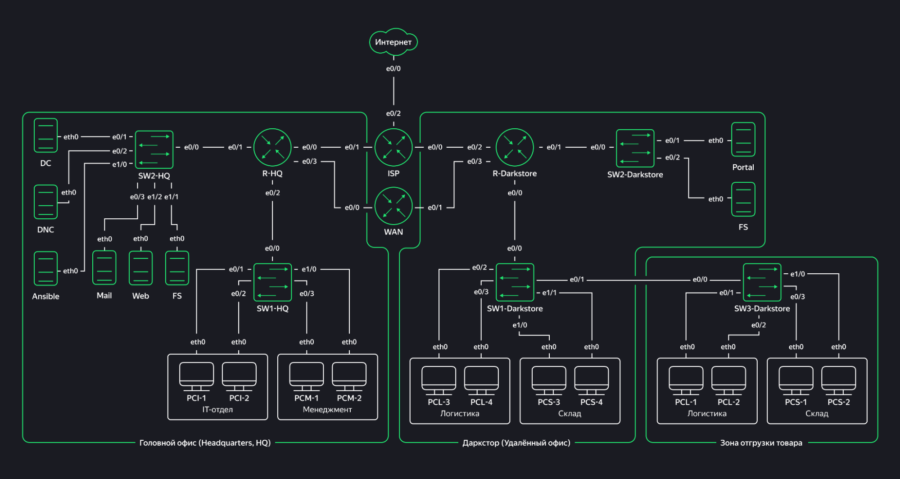
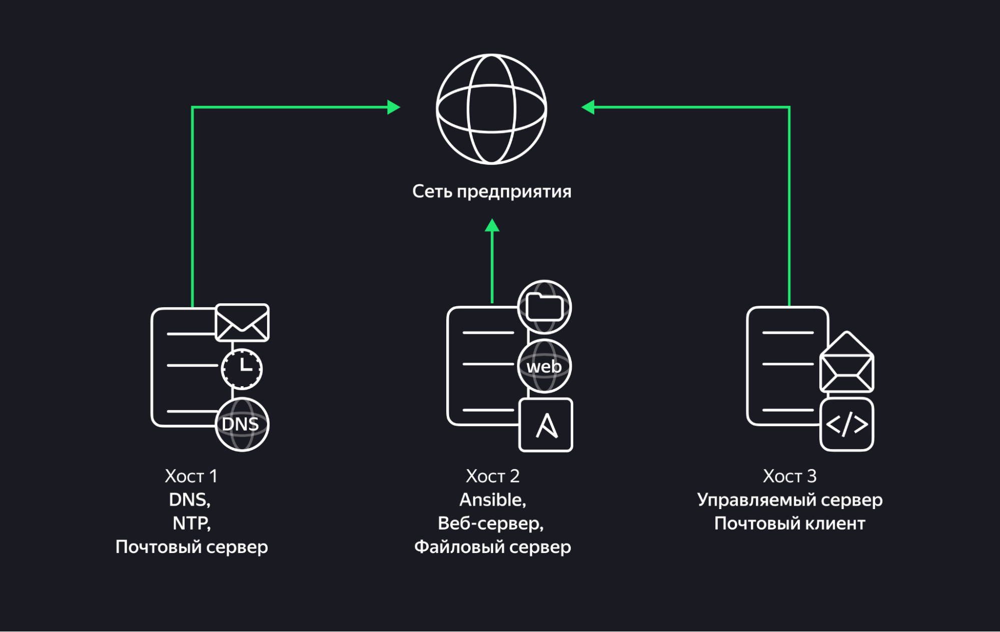
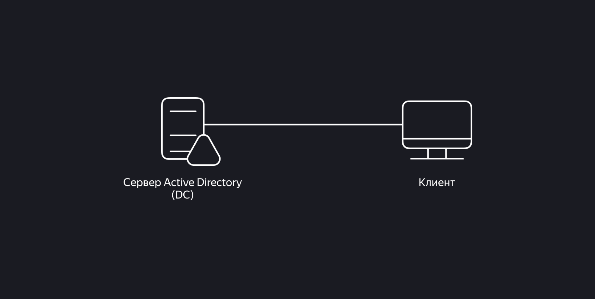

# Superstore Network, Services and Active Directory Lab

Учебный проект по проектированию корпоративной сети, настройке базовых и прикладных Linux-сервисов, автоматизации с Ansible и развёртыванию Active Directory для компании Superstore.

Проект выполнен в рамках профессиональной переподготовки по программе «Специалист по информационной безопасности» в Яндекс Практикуме.

> Все работы выполнялись в изолированной учебной среде с использованием EVE-NG и виртуальных машин. Публичный репозиторий содержит только учебные материалы, схемы и результаты проверок. Реальные учётные данные, ключи и конфиденциальная информация не публикуются.

## Цель проекта

Спроектировать и настроить работоспособную инфраструктуру компании с главным офисом и удалённой площадкой: реализовать сегментацию сети, маршрутизацию, доступ к внешним ресурсам, базовые сетевые службы, автоматизацию администрирования и централизованное управление Windows-клиентами через Active Directory.

## Состав проекта

Проект состоит из трёх взаимосвязанных частей:

| Часть | Направление | Основной результат |
|---|---|---|
| 1 | Дизайн и конфигурация сети | VLAN, trunk, inter-VLAN routing, DHCP, NAT/PAT, DNAT и межофисная маршрутизация |
| 2 | Базовые и прикладные Linux-сервисы | DNS, NTP, Ansible, резервное копирование, Postfix, FTP и Nginx |
| 3 | Active Directory | Домен, OU, пользователь, компьютер, группа и применение GPO |

## Архитектура сети

Инфраструктура включает главный офис, удалённый даркстор, зону отгрузки товаров, провайдера связи, выделенный WAN-канал и тестовый ресурс в Интернете.



### VLAN и адресный план

Для разделения подразделений и серверов использовано адресное пространство `10.10.0.0/16`.

| VLAN | Сегмент | Подсеть | Назначение |
|---|---|---|---|
| 10 | IT | `10.10.1.0/24` | Рабочие станции IT-отдела |
| 20 | Management | `10.10.2.0/24` | Рабочие станции менеджмента |
| 30 | Logistics | `10.10.3.0/24` | Рабочие станции логистики |
| 40 | Storage | `10.10.4.0/24` | Рабочие станции склада |
| 50 | HQ-Servers | `10.10.5.0/24` | Серверы головного офиса |
| 60 | DS-Servers | `10.10.6.0/24` | Серверы даркстора |

Между сетевыми устройствами настроены trunk-соединения с ограниченным перечнем разрешённых VLAN. Межвлановая маршрутизация реализована на маршрутизаторах R-HQ и R-Darkstore с использованием субинтерфейсов.

## Часть 1. Сеть и маршрутизация

В EVE-NG была настроена сетевая инфраструктура главного офиса и даркстора.

### Выполненные работы

- Настроены VLAN для IT, менеджмента, логистики, склада и серверных сегментов.
- Настроены access-порты коммутаторов для рабочих станций и серверов.
- Настроены trunk-подключения между коммутаторами и маршрутизаторами с ограничением разрешённых VLAN.
- Назначены статические IP-адреса серверным системам.
- Настроена inter-VLAN routing через субинтерфейсы маршрутизаторов.
- Настроены DHCP-пулы для пользовательских сегментов головного офиса и даркстора.
- Настроены внешние стыки с провайдером и маршруты по умолчанию.
- Настроен NAT/PAT для выхода внутренних VLAN в Интернет через публичные IP-адреса.
- Настроен статический NAT/DNAT для публикации веб-сервера головного офиса через TCP-порт `8080`.
- Настроена статическая маршрутизация между офисами через выделенный WAN-канал.
- Выполнены проверки связности, DHCP, маршрутизации, NAT-трансляций и публикации веб-сервера.

### Проверки

Выполнялись проверки:

- `ping` внутри одного VLAN и между VLAN.
- Проверка шлюзов по умолчанию.
- Проверка автоматической выдачи адресов DHCP.
- Проверка таблиц маршрутизации.
- Проверка NAT с помощью `show ip nat statistics`.
- Проверка NAT-трансляций с помощью `show ip nat translations`.
- Проверка публикации веб-сервера через `telnet` на TCP-порт `8080`.
- Проверка связности между головным офисом и даркстором.

## Часть 2. Linux-сервисы и Ansible

На трёх Linux-хостах были настроены базовые и прикладные сервисы.



| Хост | Роли |
|---|---|
| Host 1 | DNS, NTP, почтовый сервер |
| Host 2 | Ansible, веб-сервер, FTP-сервер, файловый сервер |
| Host 3 | Управляемый сервер и почтовый клиент |

### DNS и NTP

- Настроен DNS-сервис на базе `dnsmasq`.
- Настроена доменная зона `practicumsuperstore.ru`.
- Добавлены A-записи для корпоративных сервисов.
- Настроена MX-запись для почтового сервера.
- Отключён `systemd-resolved` во избежание конфликтов со службой DNS.
- Настроена синхронизация времени через `chrony`.
- Для инфраструктуры использована временная зона Москвы, UTC+3.
- Проверены DNS-запросы с помощью `nslookup` и синхронизация с помощью `chronyc tracking` и `timedatectl`.

### Ansible и резервное копирование

- Установлен и настроен Ansible на управляющем сервере.
- Создан отдельный пользователь для управления хостами по SSH.
- Настроен доступ по SSH между Ansible-сервером и управляемым хостом.
- Создан playbook `setup_services.yml` для настройки DNS и NTP.
- Создан playbook `create_user.yml` для создания пользователя резервного копирования.
- Создан playbook `configure_backup.yml` для настройки каталога резервных копий и задания `cron`.
- Настроена автоматическая передача резервных копий с управляемого хоста на сервер Ansible.
- Проверены расписание задач и содержимое архива резервных копий.

### Почтовый сервис

- Настроены Postfix, mailutils и DNS-записи для почтового обмена.
- Настроена MX-запись `mail.practicumsuperstore.ru`.
- Настроен почтовый клиент на управляемом хосте.
- Выполнена отправка и проверка доставки тестовых сообщений.
- Проверены журнал Postfix и содержимое почтового ящика пользователя.

### FTP-сервис

- Установлен и настроен `vsftpd`.
- Создан отдельный FTP-пользователь.
- Настроен каталог для обмена файлами.
- Настроены параметры `local_enable`, `write_enable`, `chroot_local_user` и `allow_writeable_chroot`.
- Выполнена проверка загрузки и скачивания тестового файла с FTP-сервера.

### Веб-сервис

- Установлен и настроен Nginx.
- Развёрнут тестовый веб-сайт.
- Настроены пользовательские страницы ошибок.
- Настроен доступ к защищённому каталогу с базовой HTTP-аутентификацией.
- Настроены права доступа к защищённой директории.
- Проверены открытие сайта с клиентского хоста и записи в `access.log`.

## Часть 3. Active Directory

В тестовой Windows-инфраструктуре развёрнут контроллер домена и подключён клиент.



### Выполненные работы

- Установлены роли Active Directory Domain Services и DNS Server.
- Развёрнут домен:

```text
practicumsuperstore.local
```

- Создана организационная единица `IT`.
- Создана доменная пользовательская учётная запись `student`.
- Создана и настроена групповая политика для IT-подразделения.
- В политике настроено интерактивное сообщение при входе:
  - Заголовок: `Поздравляем`
  - Текст: `Политика успешно применена!`
- Windows-клиент PCI-1 присоединён к домену.
- Учётная запись компьютера PCI-1 перенесена в OU `IT`.
- Проверено применение GPO при входе доменного пользователя на клиенте.

## Инструменты и технологии

`EVE-NG` · `Cisco IOS` · `VLAN` · `802.1Q` · `Trunk` · `Inter-VLAN Routing` · `DHCP` · `NAT/PAT` · `DNAT` · `Static Routing` · `WAN` · `Linux` · `dnsmasq` · `chrony` · `Ansible` · `SSH` · `cron` · `Postfix` · `mailutils` · `vsftpd` · `Nginx` · `Active Directory` · `DNS Server` · `OU` · `GPO` · `Windows Server`

## Артефакты проекта

> Архив со скриншотами выполнения и проверок будет добавлен после загрузки в репозиторий.

- [Топология сети Superstore](superstore-network-topology.jpg)
- [Роли и взаимодействие Linux-хостов](superstore-linux-services.jpg)
- [Схема тестового стенда Active Directory](superstore-active-directory.jpg)

### Скриншоты проверок

| Часть | Содержание | Количество скриншотов |
|---|---|---:|
| Часть 1 | VLAN, маршрутизация, DHCP, NAT, DNAT и межофисная связность | 52 |
| Часть 2 | DNS, NTP, Ansible, Postfix, FTP и Nginx | 47 |
| Часть 3 | Развёртывание Active Directory и проверка GPO | 15 |
| Всего | Результаты выполнения всех заданий | 114 |

## Безопасность публикации

- Все работы выполнены в изолированной учебной среде.
- В репозитории не публикуются реальные пароли, SSH-ключи, учётные данные, токены и персональные данные.
- Схемы, адреса и настройки относятся только к учебному стенду.
- Материалы приведены в образовательных целях и не предназначены для применения к чужим системам без разрешения.

## Автор

Владимир Бурдин  
Специалист по информационной безопасности

- GitHub: [@vladimirbr-rgb](https://github.com/vladimirbr-rgb)
- HH.ru: [резюме](https://hh.ru/resume/f0a4ab52ff111561650039ed1f56506a4b797a)
- Telegram: [@VIBVID](https://t.me/VIBVID)
